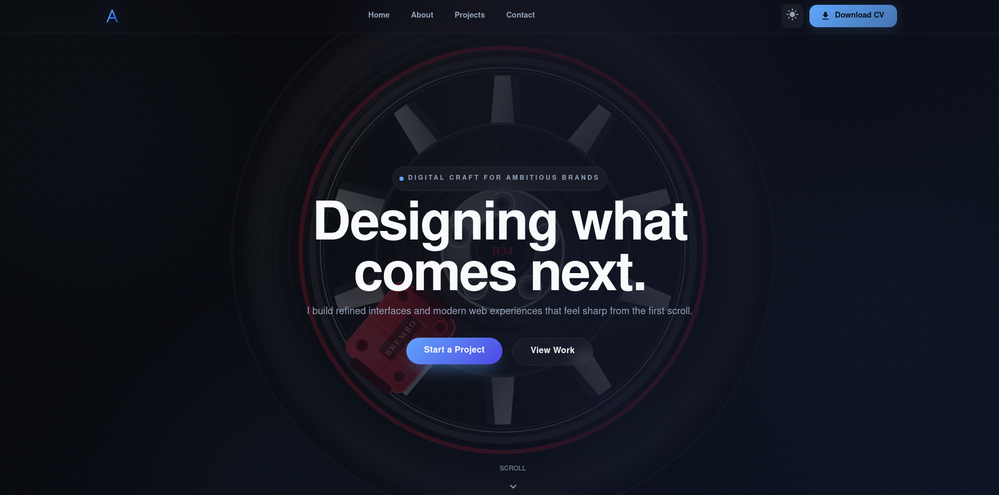

# Mohamed Afzal | Portfolio

> A responsive developer portfolio for showcasing projects, technical skills, certificates, and contact information.

<p align="center">
  <a href="https://mohamed-afzal-lovat.vercel.app/">
    
  </a>
</p>

<p align="center">
  <a href="https://mohamed-afzal-lovat.vercel.app/">View Live Website</a>
  ·
  <a href="https://github.com/Mohamed-Afzal0/Mohamed_Afzal">View Source Code</a>
  ·
  <a href="mailto:afzalsfm@gmail.com">Contact Me</a>
</p>

## Overview

This portfolio is built to present Mohamed Afzal's work as a full-stack developer and UI-focused engineer. It combines a responsive React interface with animated sections, project cards, contact tools, downloadable CV access, and a performance-aware visual background.

The website is designed for both desktop and mobile users, supports light and dark themes, and respects the user's reduced-motion preference.

## Access The Website

### Live deployment

Open the deployed portfolio at **[mohamed-afzal-lovat.vercel.app](https://mohamed-afzal-lovat.vercel.app/)**.

### Run it locally

```bash
git clone https://github.com/Mohamed-Afzal0/Mohamed_Afzal.git
cd Mohamed_Afzal
npm ci
npm run dev
```

Then open [http://localhost:5173](http://localhost:5173).

### Preview a production build

```bash
npm run build
npm run preview
```

The preview server is normally available at [http://localhost:4173](http://localhost:4173).

## What Is Included

- Responsive sections for Home, About, Projects, Contact, and Footer
- Light and dark theme switching based on the system preference
- Interactive project cards with GitHub and live-demo links
- Animated page loading, scroll reveals, text reveals, magnetic buttons, and scroll progress
- 3D-inspired tire background with lighter behavior on mobile devices
- Reduced-motion support for more accessible browsing
- Downloadable CV button linked to `public/CV.pdf`
- Contact form powered by EmailJS
- Social links for GitHub, LinkedIn, and Instagram
- Certificates and technology showcase
- Production Docker image served through Nginx

## Featured Projects

The portfolio currently showcases:

| Project | Description | Links |
| --- | --- | --- |
| Smart Campus Sensor Room Management API | REST API for managing and monitoring smart-campus sensor rooms. | [GitHub](https://github.com/Mohamed-Afzal0/Smart-Campus-Sensor-Room-Management-API) |
| Server Monitor Dashboard | Real-time system monitoring dashboard built with Python, Flask, psutil, Docker, and Chart.js. | [GitHub](https://github.com/Mohamed-Afzal0/Server-Monitor) |
| Mind Wave | Mood and mental-health tracking application built with React Native, Expo, Firebase, and Node.js. | [Portfolio project section](https://mohamed-afzal-lovat.vercel.app/#projects) |
| Portfolio Website | This React portfolio, built with Vite, Material UI, Framer Motion, Docker, and Vercel. | [Live site](https://mohamed-afzal-lovat.vercel.app/) · [GitHub](https://github.com/Mohamed-Afzal0/Mohamed_Afzal) |
| Estate Agent Application | Responsive property listing experience for an estate agent brand. | [GitHub](https://github.com/Mohamed-Afzal0/estate-agent-app) · [Live site](https://mohamed-afzal0.github.io/estate-agent-app/) |

## Technology Stack

### Frontend

- React 19
- Vite
- JavaScript, HTML, and CSS
- Material UI
- Framer Motion
- React Three Fiber and Three.js

### Supporting tools

- EmailJS for the contact form
- Docker and Docker Compose
- Nginx for production hosting
- Vitest, React Testing Library, and jsdom
- ESLint, Prettier, Husky, and lint-staged
- GitHub Actions for automated checks

## Contact Form Configuration

The contact form uses EmailJS. To enable message delivery locally, create a `.env` file in the project root with these Vite variables:

```env
VITE_EMAILJS_SERVICE_ID=your_service_id
VITE_EMAILJS_TEMPLATE_ID=your_template_id
VITE_EMAILJS_PUBLIC_KEY=your_public_key
```

Restart the Vite server after changing environment variables. Never commit real secrets or private service credentials to the repository.

The portfolio also provides direct contact details:

- Email: [afzalsfm@gmail.com](mailto:afzalsfm@gmail.com)
- Location: Colombo, Sri Lanka
- LinkedIn: [Mohamed Afzal](https://www.linkedin.com/in/mohamed-afzal-0b7372305/)
- GitHub: [Mohamed-Afzal0](https://github.com/Mohamed-Afzal0)
- Instagram: [@_mohamed_afzal_](https://www.instagram.com/_mohamed_afzal_/)

## Docker

The project uses a multi-stage Docker build. Node builds the Vite application, and a small Nginx image serves the generated `dist` directory.

### Start with Docker Compose

```bash
docker compose up --build -d
```

Open [http://localhost](http://localhost).

View logs or stop the service with:

```bash
docker compose logs -f app
docker compose down
```

### Build and run the image directly

```bash
docker build -t portfolio-app:latest .
docker run --name portfolio -p 80:80 portfolio-app:latest
```

If port 80 is already in use, map another host port:

```bash
docker run --name portfolio -p 8080:80 portfolio-app:latest
```

Then open [http://localhost:8080](http://localhost:8080).

### Development with Docker hot reload

```bash
docker compose --profile dev up dev
```

Open [http://localhost:5173](http://localhost:5173).

## Testing And Quality Checks

Run the available checks before opening a pull request:

```bash
npm run lint
npm run test:run
npm run build
```

Other useful commands:

```bash
npm run test          # Watch mode
npm run test:ui       # Vitest UI
npm run test:coverage # Coverage report
npm run lint:fix      # Fix supported ESLint issues
```

Tests are located in `src/test/` and cover the logo, CV download button, and shared utility behavior.

## Project Structure

```text
.
├── public/                 # Static files, including CV.pdf
├── src/
│   ├── assets/             # Portfolio images and certificates
│   ├── animations/         # Animation variants and hooks
│   ├── components/         # Shared UI and animated components
│   ├── context/            # Theme context
│   ├── lib/                # Shared content and utilities
│   ├── Pages/              # Home, About, Projects, and Contact sections
│   ├── App.jsx             # Application shell and theme handling
│   └── main.jsx            # React entry point
├── .github/workflows/      # CI and pull-request workflows
├── Dockerfile              # Multi-stage production image
├── docker-compose.yml      # Production and development services
├── nginx.conf              # SPA routing and production server config
├── package.json            # Scripts and dependencies
└── vite.config.js          # Vite configuration
```

## Deployment

The production site is deployed on Vercel. For a new deployment, import the repository into Vercel or run:

```bash
npx vercel
```

For a container-based deployment, build the Docker image and run it on a VPS or container platform using the Docker instructions above.

## License

This repository is a personal portfolio project. Contact Mohamed Afzal before reusing personal content, images, certificates, or the CV.
